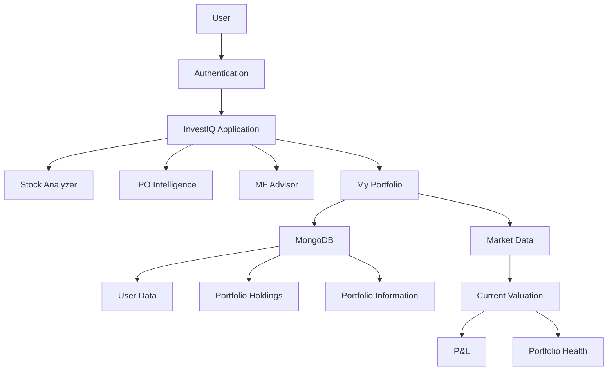
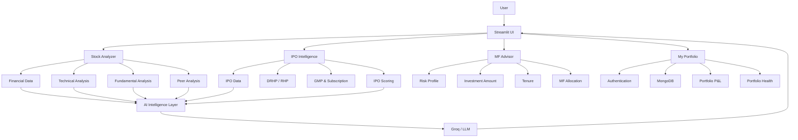

# 📊 InvestIQ — AI-Powered Investment Intelligence Platform

> **One platform for Stocks, IPOs, Mutual Funds & Personal Portfolio Analysis**

**InvestIQ** is an AI-powered investment intelligence platform designed to bring multiple areas of investment research into a single, interactive application.

Instead of switching between different platforms for stock analysis, IPO research, mutual-fund selection, and portfolio tracking, InvestIQ combines these capabilities into one unified financial analytics platform.

The platform combines **financial data, fundamental analysis, technical analysis, IPO intelligence, mutual-fund advisory, portfolio analytics, MongoDB persistence, and Generative AI** to help users make more informed investment decisions.

---

## 🚀 What is InvestIQ?

InvestIQ is built around four major investment workflows:

```text
                    ┌───────────────────────┐
                    │       InvestIQ         │
                    │ Investment Intelligence│
                    └───────────┬───────────┘
                                │
        ┌───────────────────────┼────────────────────────┐
        │                       │                        │
        ▼                       ▼                        ▼
 ┌─────────────┐         ┌─────────────┐         ┌─────────────┐
 │ Stock       │         │ IPO         │         │ MF Advisor  │
 │ Analyzer    │         │ Intelligence│         │             │
 └─────────────┘         └─────────────┘         └─────────────┘
        │                       │                        │
        └───────────────────────┼────────────────────────┘
                                ▼
                        ┌─────────────┐
                        │ My Portfolio│
                        └─────────────┘
```

The platform is designed to support the complete journey:

**Research → Analyze → Compare → Decide → Track**

---

# ✨ Key Features

### 📈 Stock Analyzer

* Detailed fundamental analysis
* Technical analysis
* Interactive price charts
* Valuation analysis
* Profitability analysis
* Financial health analysis
* Growth analysis
* Stock Health Score
* Peer comparison
* Sector/industry benchmarking
* AI-generated insights
* AI-assisted Buy/Sell analysis

### 🚀 IPO Intelligence

* IPO research dashboard
* IPO/company analysis
* DRHP/RHP document analysis
* IPO scoring
* GMP analysis
* Subscription analysis
* Listing-gain analysis
* AI-powered IPO insights

### 📊 MF Advisor

* Mutual fund advisory dashboard
* Risk-based recommendations
* Investment amount based allocation
* Tenure-based allocation
* Large-cap / mid-cap / small-cap allocation
* Fund recommendations
* AI-assisted investment insights

### 💼 My Portfolio

* Secure user authentication
* Persistent portfolio storage
* MongoDB-backed holdings
* Add/manage holdings
* Current portfolio valuation
* Profit & Loss calculation
* Portfolio health score
* Green / Yellow / Red portfolio status
* Portfolio-level analysis

---

# 🏠 Main Dashboard

The InvestIQ dashboard acts as the central entry point to the platform.

It provides access to the major investment modules:

* Stock Analyzer
* IPO Intelligence
* MF Advisor
* My Portfolio

The dashboard is designed to give users a centralized experience rather than treating each investment category as a separate application.

---

# 📈 1. Stock Analyzer

The **Stock Analyzer** is one of the core modules of InvestIQ.

It provides a comprehensive analysis of an individual company by combining fundamental, technical, comparative, and AI-powered analysis.

---

## 💰 Fundamental Analysis

InvestIQ evaluates multiple fundamental dimensions of a company.

### Valuation

Relevant valuation metrics can include:

* P/E Ratio
* P/B Ratio
* Market Capitalization
* Enterprise Value
* Other available valuation metrics

### Profitability

The platform analyzes:

* Profit Margin
* Operating Margin
* Return on Equity
* Return on Assets
* Earnings-related metrics

### Financial Health

Analysis includes available:

* Debt metrics
* Liquidity indicators
* Balance-sheet information
* Cash-flow information

### Growth

The platform evaluates available:

* Revenue growth
* Earnings growth
* Profit growth
* Historical business performance

### Shareholder & Trading Metrics

Where available:

* Dividend information
* Share-related metrics
* Trading statistics
* Market capitalization

---

# 🏥 Stock Health Score

InvestIQ converts multiple financial dimensions into a consolidated **Stock Health Score**.

The score provides a simplified view of the company's overall financial condition.

It considers factors such as:

* Valuation
* Profitability
* Financial strength
* Growth
* Market-related metrics

### Score Interpretation

|  Score | Health       |
| -----: | ------------ |
| 80–100 | 🟢 Strong    |
|  60–79 | 🟢 Healthy   |
|  40–59 | 🟡 Moderate  |
|  20–39 | 🟠 Weak      |
|   0–19 | 🔴 Very Weak |

The score is designed as an analytical indicator rather than a guaranteed prediction of future returns.

---

# 📊 Technical Analysis

The Stock Analyzer also provides technical analysis based on historical market data.

Users can analyze:

* Historical price movement
* Price trends
* Technical indicators
* Market behaviour
* Trend signals

Interactive charts allow users to explore the stock's historical performance.

---

# 📉 Interactive Charts

InvestIQ uses interactive visualizations to make financial information easier to understand.

Charts can be used to explore:

* Historical prices
* Market trends
* Financial performance
* Comparative metrics
* Technical information

---

# 🏢 Peer Comparison

A company should not always be analyzed in isolation.

InvestIQ therefore provides **peer and competitor comparison**.

The platform can compare companies using relevant financial dimensions such as:

* Valuation
* Profitability
* Growth
* Financial health
* Market metrics

It can also calculate/display relevant sector or industry benchmarks.

This allows users to understand:

> **How strong is this company compared with similar companies?**

---

# 🤖 AI Stock Insights

InvestIQ integrates Generative AI to convert financial information into understandable investment insights.

The AI layer can analyze:

* Fundamental metrics
* Technical signals
* Stock Health Score
* Peer comparison
* Company performance

The purpose is to provide a natural-language interpretation of complex financial information.

---

# 🟢 AI Buy / Sell Analysis

InvestIQ provides AI-assisted investment analysis by combining multiple signals.

The analysis can consider:

### Fundamental Signals

* Valuation
* Profitability
* Growth
* Financial strength

### Technical Signals

* Price trends
* Technical indicators
* Market behaviour

### Relative Signals

* Peer comparison
* Sector positioning

### Overall Quality

* Stock Health Score

The result can provide:

* Buy / Hold / Sell style verdict
* Confidence level
* Supporting reasoning

> ⚠️ AI-generated investment analysis is intended for research and educational purposes and should not be treated as guaranteed financial advice.

---

# 🚀 2. IPO Intelligence

The **IPO Intelligence** module is designed to help users research and evaluate upcoming IPO opportunities.

Instead of simply displaying IPO dates and subscription information, InvestIQ aims to provide a structured analytical view of an IPO.

---

## 📄 DRHP / RHP Analysis

InvestIQ includes document-oriented IPO analysis using:

* DRHP — Draft Red Herring Prospectus
* RHP — Red Herring Prospectus

The system can process IPO documentation and extract useful information for analysis.

Relevant areas include:

* Company information
* Business model
* Financial information
* Risk factors
* Issue details
* Objects of the issue
* Promoter information
* Other important IPO information

---

# ⭐ IPO Scoring Engine

InvestIQ provides an IPO scoring approach to help evaluate an IPO using multiple factors.

The scoring framework can consider:

* Financial performance
* Valuation
* Business quality
* Growth
* Risk
* Issue structure
* Market sentiment

The objective is to convert large amounts of IPO information into a more structured analytical score.

---

# 📈 GMP Analysis

The IPO module also considers **Grey Market Premium (GMP)** as one of the market-sentiment indicators.

GMP can be used alongside other IPO factors rather than being treated as the sole decision-making metric.

---

# 📊 Subscription Analysis

InvestIQ can analyze IPO subscription information across investor categories where data is available.

Relevant categories may include:

* Retail
* HNI/NII
* QIB
* Overall subscription

This provides a clearer view of market demand.

---

# 🔮 Listing Gain Analysis

The IPO Intelligence module is designed to analyze potential listing performance using multiple available signals.

Factors can include:

* GMP
* Subscription demand
* Valuation
* Company fundamentals
* Market sentiment
* IPO pricing

The objective is to provide analytical context rather than guarantee listing returns.

---

# 🤖 AI-Powered IPO Insights

Generative AI can be used to summarize and interpret IPO information.

Instead of forcing users to read lengthy IPO documents manually, the system can help surface:

* Key positives
* Major risks
* Financial observations
* Business strengths
* Potential concerns
* Overall IPO outlook

---

# 📊 3. MF Advisor

The **MF Advisor** module is designed to help users build a mutual-fund allocation based on their personal investment parameters.

The module focuses on three major inputs:

### 💰 Investment Amount

The user can specify how much money they want to invest.

Example:

```text
Investment Amount: ₹1,00,000
```

### ⚠️ Risk Appetite

The user can select a risk profile such as:

* Low
* Medium
* High

### ⏳ Investment Tenure

The user can specify the intended investment period.

The system then uses these inputs to determine a suitable allocation strategy.

---

# 🧩 Mutual Fund Allocation

The MF Advisor can structure allocation across categories such as:

```text
Large Cap
Mid Cap
Small Cap
```

The percentage allocation can vary according to:

* Risk appetite
* Investment amount
* Investment tenure

For example, a higher-risk profile may allow greater exposure to mid-cap/small-cap categories, while a conservative profile can emphasize relatively stable categories.

---

# 💡 Fund Recommendations

The MF Advisor is designed to provide relevant fund suggestions based on the user's selected investment profile.

The recommendation workflow considers:

* Risk profile
* Investment amount
* Tenure
* Fund category
* Historical/available fund information

The purpose is to provide a structured starting point for mutual-fund research.

---

# 📌 Personalized Investment Planning

Instead of recommending the same funds to every user, the MF Advisor uses the user's:

```text
Investment Amount
        +
Risk Appetite
        +
Investment Tenure
        ↓
Recommended Allocation
        ↓
Fund Suggestions
```

This makes the module more personalized than a basic mutual-fund listing page.

---

# 💼 4. My Portfolio

**My Portfolio** is the personal investment tracking module of InvestIQ.

It connects the research side of InvestIQ with the user's own investments.

---

# 🔐 User Authentication

My Portfolio is designed around authenticated user accounts.

Authentication allows portfolio information to remain associated with the correct user.

The workflow is:

```text
User
 ↓
Login / Authentication
 ↓
User Account
 ↓
Personal Portfolio
 ↓
MongoDB
```

---

# 🗄️ MongoDB Portfolio Persistence

Portfolio information is stored persistently using **MongoDB**.

This means portfolio holdings are not simply temporary browser/session data.

User portfolio information can be:

* Stored
* Retrieved
* Updated
* Associated with the authenticated user

When the user returns and logs in again, their stored portfolio can be retrieved.

---

# 📦 Portfolio Holdings

Users can maintain their holdings inside My Portfolio.

Relevant holding information can include:

* Stock/asset
* Quantity
* Purchase information
* Current value
* Investment value
* Profit/Loss

The portfolio module then calculates the overall portfolio position.

---

# 💰 Portfolio Value & P&L

InvestIQ calculates portfolio-level metrics such as:

### Invested Value

The total amount invested across the user's holdings.

### Current Value

The current estimated value of the holdings based on available market data.

### Profit / Loss

```text
P&L = Current Portfolio Value - Invested Value
```

This allows users to quickly understand how their portfolio is performing.

---

# 🏥 Portfolio Health Score

My Portfolio also includes a portfolio-level health assessment.

The portfolio can be represented using a simple status system:

| Status    | Meaning                    |
| --------- | -------------------------- |
| 🟢 Green  | Healthy                    |
| 🟡 Yellow | Moderate / Needs Attention |
| 🔴 Red    | Higher Risk / Needs Review |

The portfolio health system is intended to help users quickly identify whether their overall portfolio requires attention.

---

# 🔄 Complete Portfolio Workflow

```text
Login
  ↓
User Authentication
  ↓
Retrieve Portfolio from MongoDB
  ↓
Load Holdings
  ↓
Fetch Current Market Data
  ↓
Calculate Current Value
  ↓
Calculate P&L
  ↓
Analyze Portfolio
  ↓
Portfolio Health Score
  ↓
Display Dashboard
```

---

# 🧠 InvestIQ's Complete Investment Workflow

The major modules are designed to work together rather than operate as isolated pages.

```text
                    INVESTIQ
                       │
       ┌───────────────┼────────────────┐
       │               │                │
       ▼               ▼                ▼
   STOCKS             IPOs          MUTUAL FUNDS
       │               │                │
       ▼               ▼                ▼
  Stock Analysis   IPO Analysis     MF Advisor
       │               │                │
       └───────────────┼────────────────┘
                       ▼
                 INVESTMENT DECISION
                       │
                       ▼
                 MY PORTFOLIO
                       │
             ┌─────────┴─────────┐
             ▼                   ▼
        P&L Analysis       Portfolio Health
```

This creates a complete investment-analysis ecosystem:

**Research → Evaluate → Compare → Invest → Track**

---

# 🧠 AI & Intelligence Layer

AI is integrated into InvestIQ as an analytical assistance layer.

It can support:

* Stock insights
* IPO interpretation
* Financial analysis
* Investment reasoning
* Natural-language explanations
* Buy/Sell analysis
* Risk interpretation

The AI layer is designed to work with structured financial information rather than functioning as a generic chatbot.

---

# 🗄️ Database Architecture

MongoDB provides persistent storage for user-related application data, particularly the portfolio/authentication workflow.

Conceptually:



---

# 🛠️ Technology Stack

## Application

* **Python**
* **Streamlit**

## Data Visualization

* **Plotly**

## Financial Data

* **Yahoo Finance**
* **yfinance**

## Database

* **MongoDB**

## AI

* **Groq API**
* Generative AI / LLM-based analysis

## Data & Financial Analytics

* Fundamental analysis
* Technical analysis
* Financial scoring
* Peer comparison
* IPO analysis
* Mutual-fund allocation
* Portfolio analytics

## Development

* Git
* GitHub
* VS Code
* Python virtual environment
* Environment variables

---

# 🏗️ High-Level Architecture



---

# 📁 Project Structure

The application is organized around its major financial modules.

```text
InvestIQ/
│
├── app.py
│
├── pages/
│   ├── IPO Intelligence
│   ├── Stock Analyzer
│   ├── MF Advisor
│   └── My Portfolio
│
├── modules/
│   ├── stock analysis
│   ├── IPO analysis
│   ├── mutual fund analysis
│   ├── portfolio management
│   └── AI analysis
│
├── database/
│   └── MongoDB integration
│
├── utils/
│   └── helper / data-processing functions
│
├── requirements.txt
├── .env
├── .gitignore
└── README.md
```

> Folder names should be updated to match the exact current repository structure.

---

# ⚙️ Installation

## 1. Clone the Repository

```bash
git clone <your-repository-url>
cd InvestIQ
```

## 2. Create Virtual Environment

```bash
python -m venv venv
```

### Windows

```bash
venv\Scripts\activate
```

## 3. Install Dependencies

```bash
pip install -r requirements.txt
```

## 4. Configure Environment Variables

Create a `.env` file and configure the required credentials.

Example:

```env
GROQ_API_KEY=your_groq_api_key
MONGODB_URI=your_mongodb_connection_string
```

Never upload actual credentials to GitHub.

## 5. Run InvestIQ

```bash
python -m streamlit run app.py
```

---

# 🔐 Security

InvestIQ uses environment variables for sensitive configuration.

Sensitive information such as:

* API keys
* MongoDB connection strings
* Passwords
* Authentication secrets

should never be committed to the public repository.

---

# 📊 Data Sources

InvestIQ can work with multiple types of financial information, including:

* Market data
* Historical price data
* Company fundamentals
* IPO information
* GMP information
* Subscription information
* Mutual-fund information
* Portfolio market data

Data availability depends on the underlying provider and external APIs.

---

# ⚠️ Limitations

InvestIQ relies on external financial-data sources and AI services.

Potential limitations include:

* External API availability
* API rate limits
* Missing financial data
* IPO data availability
* GMP data availability
* Mutual-fund data availability
* AI response variability
* Market-data freshness

The application should therefore be considered an **investment research and analysis tool**, not a guaranteed prediction system.

---

# 🔮 Future Enhancements

Potential future improvements include:

* Advanced portfolio optimization
* More detailed risk analysis
* Portfolio diversification analysis
* Advanced stock forecasting
* Backtesting
* More IPO data sources
* Expanded mutual-fund analytics
* Investment alerts
* Price alerts
* Portfolio notifications
* Advanced ML prediction models
* Cloud deployment
* Mobile application
* Expanded authentication features

---

# 📌 Project Status

### 🟢 Active Development

InvestIQ is being developed as a comprehensive investment-intelligence platform.

### Major Modules

| Module              | Purpose                                   |
| ------------------- | ----------------------------------------- |
| 📈 Stock Analyzer   | Fundamental + technical stock analysis    |
| 🚀 IPO Intelligence | IPO research, scoring & analysis          |
| 📊 MF Advisor       | Risk-based mutual-fund planning           |
| 💼 My Portfolio     | Personal holdings, P&L & portfolio health |
| 🔐 Authentication   | User-specific access                      |
| 🗄️ MongoDB         | Persistent portfolio/user data            |
| 🤖 AI Intelligence  | AI-assisted financial insights            |

---

# 🌟 Why InvestIQ?

InvestIQ is not designed as a simple stock-price tracker.

It combines:

```text
Stock Analysis
      +
IPO Intelligence
      +
Mutual Fund Advisory
      +
Personal Portfolio Tracking
      +
AI-Powered Insights
      +
Financial Data
      +
MongoDB Persistence
      =
Complete Investment Intelligence Platform
```

The project demonstrates the practical integration of:

* Financial technology
* Artificial Intelligence
* Data analytics
* Financial visualization
* Database systems
* API integration
* Interactive web applications

---

# 🎓 Project Objectives

The major objectives of InvestIQ are to:

1. Centralize multiple investment-analysis workflows.
2. Make financial information easier to understand.
3. Provide structured stock analysis.
4. Simplify IPO research.
5. Assist users with mutual-fund allocation.
6. Allow users to track their personal holdings.
7. Provide portfolio-level P&L and health analysis.
8. Use AI to generate understandable financial insights.
9. Demonstrate a practical FinTech application using modern technologies.

---

# 🤝 Contributing

Contributions and suggestions are welcome.

```bash
git checkout -b feature/your-feature
git add .
git commit -m "Add your feature"
git push origin feature/your-feature
```

Then create a Pull Request.

---

# 👨‍💻 Author

## Rudra Singh

**B.Tech — Computer Science & Engineering (AI/ML)**

### Areas of Interest

* Artificial Intelligence
* Machine Learning
* Financial Technology
* Data Analytics
* Software Development
* Investment Analytics

---

# ⚠️ Disclaimer

InvestIQ is an educational and analytical software project.

Information, scores, AI-generated insights, IPO analysis, mutual-fund suggestions, Buy/Sell analysis, portfolio-health scores, and other outputs provided by the platform are intended for **research and informational purposes only**.

They should not be considered guaranteed investment returns or professional financial advice.

Users should conduct their own research and consult a qualified financial professional before making investment decisions.

---

# ⭐ Support the Project

If you find InvestIQ useful or interesting, consider giving the repository a ⭐ on GitHub.

**InvestIQ — Research Smarter. Analyze Better. Invest Informed.**
